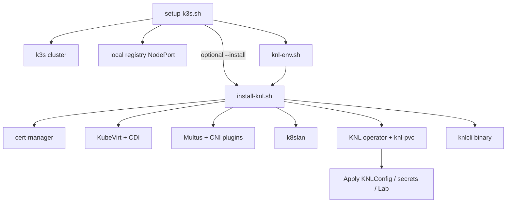

# KNL Installation Scripts

These scripts automate bootstrapping a single-node **k3s** cluster and installing all KNL prerequisites and the KNL operator in one workflow. They are intended for dev and lab environments.

[`install-knl.sh`](install-knl.sh) is **distribution-agnostic**: it installs the KNL stack on any existing Kubernetes cluster, provided the required `KNL_*` environment variables are set. [`setup-k3s.sh`](setup-k3s.sh) is the reference cluster-setup script for k3s; other distributions can add a `setup-<distro>.sh` that exports the same variables.

For manual or production installs, see [Manual install](https://hujun-open.github.io/knldoc/docs/install/install/#manual-install) in the knldoc install guide. Full scripts documentation: [Install with scripts (k3s)](https://hujun-open.github.io/knldoc/docs/install/install/#install-with-scripts-k3s).

## Quick start

**Prerequisites:** Linux host, root/sudo access, `curl`, and outbound network access to GitHub and Helm chart registries.

```bash
# Full setup (k3s + KNL components)
sudo ./scripts/setup-k3s.sh --install

# Or in two steps
sudo ./scripts/setup-k3s.sh
source ./scripts/knl-env.sh
./scripts/install-knl.sh
```

## Workflow



## Files in this directory

| File | Role |
|------|------|
| [`setup-k3s.sh`](setup-k3s.sh) | Install/configure k3s, local registry, Helm, k9s; write `knl-env.sh` |
| [`install-knl.sh`](install-knl.sh) | Install KNL stack on any cluster with `KNL_*` env set |
| [`knl-env.sh`](knl-env.sh) | **Generated** env exports (do not hand-edit; re-run setup) |

## setup-k3s.sh

Install and configure a single-node k3s cluster for KNL. **Must be run as root** (`sudo`).

### Options

| Option | Description |
|--------|-------------|
| `--install` | Run `install-knl.sh` after cluster setup |
| `--k3s-version VER` | Pin k3s version (e.g. `v1.31.2+k3s1`) |
| `--storage-class SC` | Storage class for knl-pvc (default: `local-path`) |
| `--registry-nodeport P` | NodePort for local registry (default: `30500`) |
| `--registry-size SIZE` | PVC size for registry storage (default: `5Gi`) |
| `--skip-registry` | Skip registry deployment |
| `-h`, `--help` | Show help |

### What it does

- Installs k3s (IPv4-only or dual-stack based on host IPv6 detection)
- Disables Traefik
- Deploys `registry:2` on NodePort (default `30500`) and configures k3s insecure mirror
- Enables IPv6 forwarding (required by k8slan VXLAN)
- Installs Helm and k9s
- Symlinks `~/.kube/config` → `/etc/rancher/k3s/k3s.yaml` for the invoking user
- Writes [`knl-env.sh`](knl-env.sh) with k3s-specific CNI/Multus paths

## install-knl.sh

Install KNL prerequisites and the KNL operator on an existing Kubernetes cluster. Cluster setup scripts must export `KNL_*` env vars before running this script.

### Install order and versions

| Component | Default version / source |
|-----------|--------------------------|
| cert-manager | `v1.17.2` |
| KubeVirt | `v1.6.3` (+ feature gates: Sidecar, NetworkBindingPlugins, HostDevices, Root, CpuManager; macvtap tap binding) |
| CDI | `v1.63.1` |
| Multus | Helm `rke2-charts/rke2-multus` |
| CNI plugins | DaemonSet `ghcr.io/hujun-open/installcni` |
| k8slan | `releases/latest/download/all.yaml` |
| KNL operator | `releases/latest/download/all.yaml` + `knl-pvc` PVC |
| knlcli | `releases/latest/download/knlcli-linux-x86-64` → `/usr/local/bin/knlcli` |

### Options

| Option | Description |
|--------|-------------|
| `--skip-cert-manager` | Skip cert-manager installation |
| `--skip-kubevirt` | Skip KubeVirt, CDI, and KubeVirt configuration |
| `--skip-multus` | Skip Multus installation |
| `--skip-cni` | Skip containernetworking CNI plugins installation |
| `--skip-k8slan` | Skip k8slan installation |
| `--skip-knl` | Skip KNL operator installation |
| `--skip-knlcli` | Skip knlcli download |
| `-h`, `--help` | Show help |

### Sourcing

`source ./install-knl.sh` loads the installer functions only (`main()` is not run), useful for custom orchestration.

## Environment variables

### Required (set by setup-k3s.sh)

| Variable | Description |
|----------|-------------|
| `KNL_CNI_BIN_DIR` | Host path for CNI plugin binaries |
| `KNL_MULTUS_CONF_DIR` | Multus CNI config directory |
| `KNL_MULTUS_KUBECONFIG` | Multus kubeconfig path |
| `KNL_MULTUS_AUTOCONF_DIR` | Multus autoconfig directory |

### Optional

| Variable | Default | Description |
|----------|---------|-------------|
| `KNL_CERTMANAGER_VERSION` | `v1.17.2` | cert-manager release |
| `KNL_KUBEVIRT_VERSION` | `v1.6.3` | KubeVirt release |
| `KNL_CDI_VERSION` | `v1.63.1` | CDI release |
| `KNL_NAMESPACE` | `knl-system` | KNL operator namespace |
| `KNL_PVC_SIZE` | `10Gi` | Size of `knl-pvc` |
| `KNL_STORAGE_CLASS` | `local-path` | Storage class for `knl-pvc` |
| `KNL_ROLLOUT_TIMEOUT` | `600s` | Rollout wait timeout |

## knl-env.sh

This file is **auto-generated** by `setup-k3s.sh` and sourced automatically by `install-knl.sh`. Do not hand-edit it; re-run `setup-k3s.sh` to regenerate.

Example contents (k3s):

```bash
export KUBECONFIG=/etc/rancher/k3s/k3s.yaml
export KNL_CNI_BIN_DIR=/var/lib/rancher/k3s/data/cni/
export KNL_MULTUS_CONF_DIR=/var/lib/rancher/k3s/agent/etc/cni/net.d
export KNL_MULTUS_KUBECONFIG=/var/lib/rancher/k3s/agent/etc/cni/net.d/multus.d/multus.kubeconfig
export KNL_MULTUS_AUTOCONF_DIR=/var/lib/rancher/k3s/agent/etc/cni/net.d
export KNL_STORAGE_CLASS=local-path
export KNL_REGISTRY=localhost:30500
```

For non-k3s clusters, create an equivalent file manually with paths appropriate to that distribution's CNI layout.

## Post-install

After `install-knl.sh` completes:

### 1. Create a KNLConfig CR

Create a `KNLConfig` YAML with your desired settings and apply it:

```bash
kubectl -n knl-system apply -f knlcfg.yaml
```

See the [KNLConfig documentation](https://hujun-open.github.io/knldoc/docs/usage/knlconfig/) for all options.

### 2. Update knl-sftp credentials (optional)

```bash
kubectl -n knl-system edit secret knl-sftp
```

### 3. Provision licenses

Some node types require a license secret. Example for vSIM:

```bash
kubectl -n knl-system create secret generic vsimlic --from-file=license=<lic_file>
```

See the [node type documentation](https://hujun-open.github.io/knldoc/docs/nodes/) for default secret names per node type.

### 4. Create a Lab

Create a `Lab` CR YAML defining your topology and apply it:

```bash
kubectl -n knl-system apply -f lab.yaml
```

See the [quickstart guide](https://hujun-open.github.io/knldoc/docs/usage/quickstart/) for an example.

## Other Kubernetes distributions

To use `install-knl.sh` on an existing cluster (RKE2, kubeadm, etc.), a `setup-<distro>.sh` script must export the four required `KNL_*` path variables for that distribution's CNI layout. [`setup-k3s.sh`](setup-k3s.sh) is the reference implementation.
